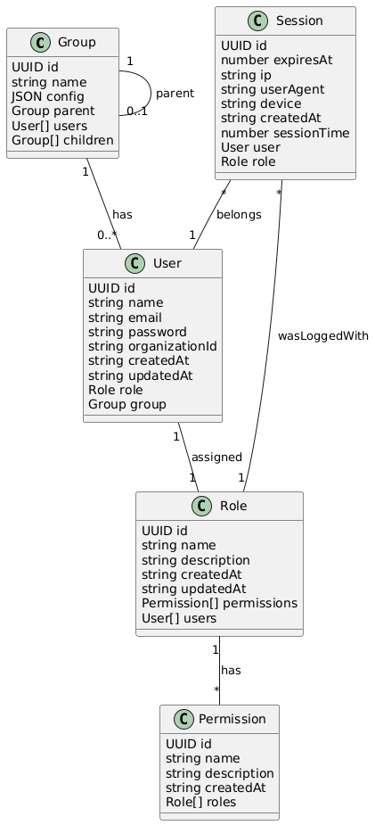
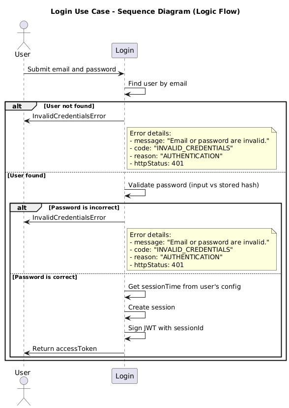

# 🧠 User Management – Documentation

## 📚 Overview

This system uses **Role-Based Access Control (RBAC)** to manage and enforce user permissions across multiple microservices. Roles are associated with a set of permissions, and each permission follows a consistent naming convention to allow fine-grained and scalable access control.

---

## 🔐 RBAC Structure

- Users are assigned to roles.
- Roles contain a list of permissions.
- Permissions define the allowed actions a role can perform on specific services and functionalities.

---

## ✅ Permission String Format

Each permission string is composed of **three segments**, separated by a dot (`.`):

```
microserviceName.permissionLevelOrScope.functionName
```

### 📌 Example

| Permission                                  | Meaning                                                      |
| ------------------------------------------- | ------------------------------------------------------------ |
| `user-management.basic.createUser`          | Allows calling `createUser` in the `user-management` service |
| `credit-card-service.transactional.capture` | Allows capturing transactions in `credit-card-service`       |

---

## ✨ Wildcards Supported

The system supports **wildcards** (`*`) at any level to simplify permission management.

### 📋 Supported Wildcard Patterns

| Pattern                  | Meaning                                              |
| ------------------------ | ---------------------------------------------------- |
| `*.*.*`                  | Full access to all services and actions              |
| `users.*.*`              | Full access to the `users` microservice              |
| `users.read.*`           | Read access to all functions in `users`              |
| `users.write.createUser` | Write access specifically to `createUser` in `users` |
| `*.read.*`               | Read access to all functions in all services         |

> ⚠️ **Wildcard Notes**
>
> - Wildcards should be used carefully to avoid overexposing access.
> - Always prefer specific permissions when possible.

---

## 📌 Real-World Examples

| Role                 | Permissions                                                               |
| -------------------- | ------------------------------------------------------------------------- |
| `admin`              | `*.*.*`                                                                   |
| `user-creator`       | `user-management.basic.createUser`                                        |
| `transaction-viewer` | `credit-card-service.read.*`                                              |
| `support-agent`      | `user-management.read.getUser`, `credit-card-service.read.getTransaction` |

---

## 🧩 User Groups & Config Inheritance

Users can optionally belong to **groups**, and each group can have a **config object** that defines things like session timeouts.

Groups can also form **hierarchies**, where each group inherits config values from its parent.

### ✅ Config Resolution Logic

- Configs are merged from the root group to the user’s group.
- Child config values **override** parent values.

### 📌 Example: Merged Config

```json
// Parent Group config
{ "sessionTime": 60, "features": { "beta": false } }

// Child Group config
{ "features": { "beta": true } }

// Final resolved config
{
  "sessionTime": 60,
  "features": {
    "beta": true
  }
}
```

---

## 🖼️ Entities relations UML Diagram



---

## Use cases

### Login


